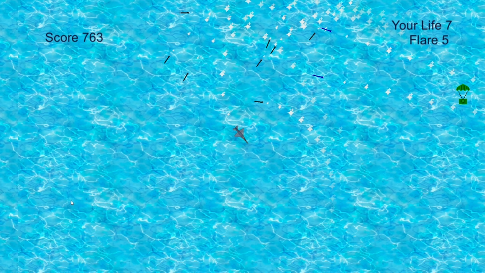

# game_KORYOSAI_2017
2017年に学校祭の専門委員企画で展示を行ったゲームプログラム

3人のグループで方向性を相談し、高専1年次に独学でC, C#プログラミングの学習を進めながら製作したもの。
実装は主に一人で行った。
旋回して追尾するミサイルや高速で直線的に突っ込んでくるミサイルを避けながら、アイテムを拾い、
スコアを集める。ミサイル同士をうまく誘導してぶつけるとアイテムが生成される。

発射すると代わりに誘導対象になってくれ、一時的に誘導ミサイルを無効化するフレアが使用可能。

弾幕ゲームをイメージし最後にボスを出現させたが、見返すとスコア調整や挙動が非常に拙い。

